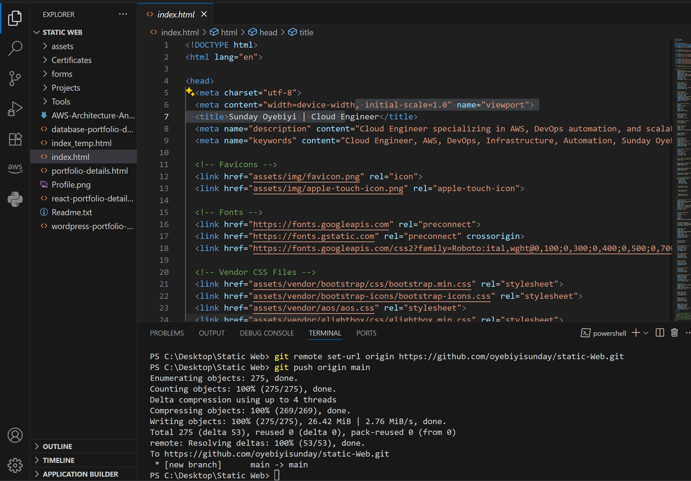

# CI/CD with GitHub Actions & AWS S3

This repository demonstrates how to automate the deployment of a static website to AWS S3 using GitHub Actions as a CI/CD pipeline.

---

## Table of Contents

- [Project Overview](#project-overview)
- [Architecture](#architecture)
- [Prerequisites](#prerequisites)
- [GitHub Actions Workflow](#github-actions-workflow)
- [Setup Instructions](#setup-instructions)
- [References](#references)
- [License](#license)

---

## Project Overview

This project provides a template for implementing CI/CD pipelines for static websites, leveraging GitHub Actions to automate build and deployment to AWS S3 buckets.

---

## Architecture

**image1:**  
  
*Illustrates the flow of code from GitHub to AWS S3 using Actions.*

**image2:**  
  
*Visualizes additional steps or overview.*

---

## Prerequisites

- An AWS account with S3 access.
- AWS CLI configured or access keys.
- GitHub repository with Actions enabled.

---

## GitHub Actions Workflow

The workflow automates the following:

1. Checkout source code
2. Install dependencies (if needed)
3. Build static site (if needed)
4. Sync build output to S3 using AWS credentials

---

## Setup Instructions

1. **Clone this repository:**
    ```sh
    git clone https://github.com/oyebiyisunday/oyebiyisunday-CI-CD-with-GitHub-Actions-AWS-S3.git
    cd oyebiyisunday-CI-CD-with-GitHub-Actions-AWS-S3
    ```
2. **Configure AWS credentials:**
   - Go to **GitHub > Settings > Secrets and variables > Actions**.
   - Add `AWS_ACCESS_KEY_ID` and `AWS_SECRET_ACCESS_KEY` as repository secrets.
   - *(Optional)* Add `AWS_REGION` and your `AWS_S3_BUCKET` if not hardcoded.

3. **Review the GitHub Actions workflow file in `.github/workflows/` and update bucket name, region, and build directory as needed.**

4. **Push your static web files (HTML, CSS, JS, etc.) to the repository.**

5. **On every push to `main`, the workflow will deploy changes to your specified S3 bucket.**

---

## References

- See the attached `CI CD.docx` for a detailed guide and walkthrough.
- Refer to the images above for visual pipeline references.

---

## License

This project is licensed under the [MIT License](LICENSE).

---

**Author:** Oyebiyi Sunday
